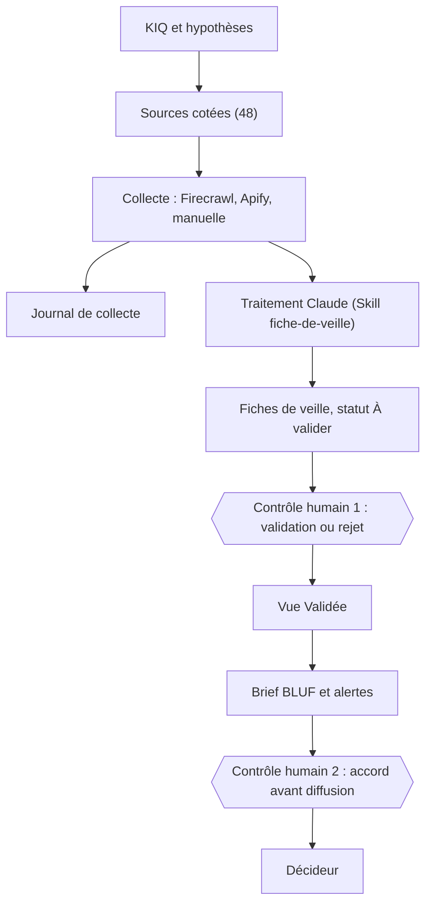

# RONA · MKG8102 · Dispositif de veille marketing (Équipe 1)

Dépôt d'équipe du cours **MKG8102 Veille marketing** (ESG UQAM, automne 2026). Il documente, à partir de l'état réel du dispositif, une plateforme de veille sur la stratégie promotionnelle de RONA dans la rénovation résidentielle au Québec.

> **Portée du dépôt.** Le dépôt décrit et versionne la configuration du dispositif : question de veille, sources cotées, schéma de la base, Skill, chaîne de collecte, seuils d'alerte, grille de confiance, jeu de test et défaillances connues. Il ne contient **aucune clé, aucun jeton, aucun mot de passe, aucune donnée personnelle** et **pas la base Airtable elle-même** (la base est privée). Chaque affirmation de cette documentation porte un statut : **vérifié** (avec date et méthode), **déclaré** (issu du mandat remis) ou **non vérifié**.

## 1. Contexte et décision à éclairer

RONA inc. (siège social à Boucherville) affronte au Québec trois concurrents directs : Canac, BMR et Home Depot Canada. La décision à éclairer est l'arbitrage du niveau et de la forme de la pression promotionnelle de RONA pour le vendredi fou et le temps des Fêtes 2026, puis sa correction de mi-saison en janvier 2027. Le décideur est la **Direction du marchandisage et des promotions, Québec**. La réponse est attendue au plus tard le **30 octobre 2026**.

## 2. Question d'intelligence clé (KIQ)

> Dans quelle mesure la stratégie promotionnelle de RONA (mises en avant produits, positionnement prix, offres spéciales) lui permettra-t-elle de gagner des parts de marché sur le segment de la rénovation résidentielle au Québec d'ici la fin de 2026 ?

Trois hypothèses rivales (H1 réplique rapide des rivaux, H2 avance tarifaire durable de RONA, H3 levier décisif non promotionnel), deux KIQ secondaires (1.1 dynamisme commercial relatif, 1.2 poids réel du levier prix) et les indicateurs discriminants sont détaillés dans [documentation/01_kiq_et_hypotheses.md](documentation/01_kiq_et_hypotheses.md).

## 3. Architecture générale

- **Mémoire** : base Airtable à cinq tables reliées (KIQ, Acteurs, Sources, Fiches de veille, Journal de collecte). Schéma : [documentation/02_schema_airtable.md](documentation/02_schema_airtable.md).
- **Chaîne, maillon par maillon**, niveaux d'automatisation et points de contrôle : [documentation/03_chaine_de_veille.md](documentation/03_chaine_de_veille.md).
- **Schémas détaillés** (modèle de données, cycle de vie d'une fiche, calendrier de collecte, diffusion et contrôles humains, gestion des échecs) : [documentation/08_schemas.md](documentation/08_schemas.md).
- **Principe** : la machine écrit uniquement au statut « À valider » et s'arrête. Une personne nommée valide ou rejette. Aucun brief ni aucune alerte ne part sans accord humain explicite.

## 4. Sources utilisées

48 sources ouvertes, toutes cotées et toutes dotées d'un champ « Biais connu » : 30 primaires (site de l'acteur) et 18 secondaires ; fiabilité : 30 Fiable, 6 Moyen, 12 Pauvre. Liste complète, avec adresse, type, cote, connecteur, fréquence et biais connu : [configuration/sources.csv](configuration/sources.csv).

## 5. Connecteurs (état vérifié le 20 septembre 2026)

| Connecteur | Rôle | Utilisé réellement | Preuve | Limites connues |
|---|---|---|---|---|
| Firecrawl | Pages web en Markdown | Oui | 84 lignes du Journal, 29 sources | Circulaires hors HTML ; pages Home Depot liées à la succursale |
| Apify | Avis publics de 12 succursales | Oui | 43 lignes du Journal, 12 sources | Panne d'authentification du 9 sept. (12 échecs, 12 reprises) |
| Airtable | Mémoire structurée | Oui | Base lue et écrite ; 4 automatisations | Voir [défaillances](documentation/06_defaillances_connues.md) |
| GitHub | Versionnement | Oui | Ce dépôt | Aucune |
| Gmail (compte dédié) | Envoi des briefs, réception des alertes | Connexion testée le 5 sept. (déclaré) ; **envoi de briefs et réception d'alertes non essayés** | Le cycle de collecte n'a pas encore produit le résultat final à envoyer | Aucune diffusion par Gmail n'est démontrée |
| Perplexity | Vérification des informations collectées, par le Responsable des insights | Oui (déclaré par l'équipe) | Aucune trace versée : requêtes et fiches vérifiées non documentées ; la déclaration du mandat indiquait « aucun autre modèle » | À documenter dans la [déclaration d'usage de l'IA](documentation/07_declaration_usage_ia.md) |

## 6. Fonctionnement de la collecte

Le mandat déclare trois tâches planifiées hebdomadaires (lundi 8 h : prix et promotions ; mardi 9 h : sources institutionnelles, emploi, presse ; mercredi 9 h : avis et localisateurs) et sept collectes manuelles là où l'automatisation a échoué (circulaires, pages Home Depot, localisateur BMR). **L'exécution récurrente est prouvée par le Journal de collecte** (154 lignes du 6 au 19 sept. 2026). **Trois tâches planifiées actives** figurent dans la liste des tâches de l'application Claude (capture d'écran fournie par l'équipe le 20 sept. 2026) : collecte hebdomadaire (lundi 8 h), collecte des informations carrière (mardi 9 h) et collecte des avis publics (mercredi 9 h). Leur texte complet courant n'a pas été relu : le début du texte affiché correspond aux instructions archivées du 9 sept., dont les mots « bimensuelle » et « mensuelle » subsistent alors que la cadence est hebdomadaire. Détails : [workflows/](workflows/) et [documentation/03_chaine_de_veille.md](documentation/03_chaine_de_veille.md).

## 7. Traitement, validation et traçabilité

- **Traitement** : Claude applique la Skill [SKILL.md](SKILL.md) (validée par l'équipe) et produit une fiche par fait : résumé, forme de veille, nature (fait, interprétation, recommandation), hypothèse concernée, crédibilité, niveau de confiance, pertinence de 1 à 5, champs vides signalés. Aucune donnée absente de la page n'est complétée.
- **Validation humaine** : le statut, le champ « Validé par » et le motif de rejet sont réservés à l'humain. État au 20 sept. 2026 : 120 fiches, dont 53 validées, 60 à valider et 7 rejetées.
- **Traçabilité** : chaque fiche renvoie à sa source, à son acteur et à sa KIQ, porte l'adresse exacte et l'extrait cité ; chaque collecte laisse une ligne au Journal, échecs compris. Grille de confiance : [documentation/05_grille_de_confiance.md](documentation/05_grille_de_confiance.md).

## 8. Diffusion

Deux canaux prévus par le mandat : un **brief BLUF aux deux semaines** vers la Direction du marchandisage et des promotions, et des **alertes au fil de l'eau** vers la Direction de l'intelligence marketing, qui décide de leur transmission. Règles et seuils : [documentation/04_alertes_et_seuils.md](documentation/04_alertes_et_seuils.md).

**État réel** : trois automatisations Airtable d'alerte interne sont déployées ; elles ont échoué faute de destinataire collaborateur de la base (du 8 au 19 sept. selon l'automatisation). Deux se sont ensuite exécutées avec succès (19 et 20 sept.) ; la troisième, hebdomadaire, n'a eu qu'une exécution, en échec, le 14 sept. Réception des courriels non vérifiée. **Gmail** : l'envoi de briefs et la réception d'alertes par Gmail n'ont **pas été essayés** à ce jour, le cycle de collecte n'ayant pas encore produit le résultat final à envoyer. Le brief remis est archivé en version texte, noms et identifiants retirés (voir [outputs/brief_decisionnel_2026-09-19.md](outputs/brief_decisionnel_2026-09-19.md) et le [registre](outputs/archive_briefs.md)).

## 9. Limites du dispositif

Angle mort assumé : la veille technologique et la veille sociétale sont exclues (une transformation logistique permettant à un rival de soutenir une guerre de prix, ou un report de la rénovation vers l'entretien, échappent au dispositif). Limites techniques, incohérences constatées et éléments non vérifiés : [documentation/06_defaillances_connues.md](documentation/06_defaillances_connues.md).

## 10. Contenu du dépôt

| Élément | Fichier |
|---|---|
| Skill d'équipe validée | [SKILL.md](SKILL.md) |
| Historique de la Skill et proposition de révision | [skills/historique/](skills/historique/) et [skills/propositions/](skills/propositions/) |
| KIQ et hypothèses | [documentation/01_kiq_et_hypotheses.md](documentation/01_kiq_et_hypotheses.md) |
| Sources cotées | [configuration/sources.csv](configuration/sources.csv) |
| Schéma de la base | [documentation/02_schema_airtable.md](documentation/02_schema_airtable.md) |
| Chaîne de veille | [documentation/03_chaine_de_veille.md](documentation/03_chaine_de_veille.md) |
| Alertes et seuils | [documentation/04_alertes_et_seuils.md](documentation/04_alertes_et_seuils.md) |
| Grille de confiance | [documentation/05_grille_de_confiance.md](documentation/05_grille_de_confiance.md) |
| Jeu de test | [tests/jeu_de_test.md](tests/jeu_de_test.md) |
| Défaillances connues et replis | [documentation/06_defaillances_connues.md](documentation/06_defaillances_connues.md) |
| Déclaration d'usage de l'IA | [documentation/07_declaration_usage_ia.md](documentation/07_declaration_usage_ia.md) |
| Conformité aux exigences officielles | [documentation/00_conformite.md](documentation/00_conformite.md) |
| Exemples de sorties réelles et brief remis (version texte) | [outputs/](outputs/) |
| Schémas Mermaid | [documentation/08_schemas.md](documentation/08_schemas.md) |

## 11. Reproduire une collecte

Un tiers peut, en principe, relancer une collecte avec ce dépôt : créer une base Airtable selon le [schéma](documentation/02_schema_airtable.md), importer [sources.csv](configuration/sources.csv), installer la [Skill](SKILL.md), brancher les connecteurs Firecrawl, Apify et Airtable, puis exécuter la procédure des [workflows](workflows/). **Cette reproduction n'a pas été testée par une personne extérieure à l'équipe** : non vérifié.

---

Documentation préparée avec Claude Code le 20 septembre 2026 à partir de lectures directes de la base et des documents du cours. Voir la [déclaration d'usage de l'IA](documentation/07_declaration_usage_ia.md).
