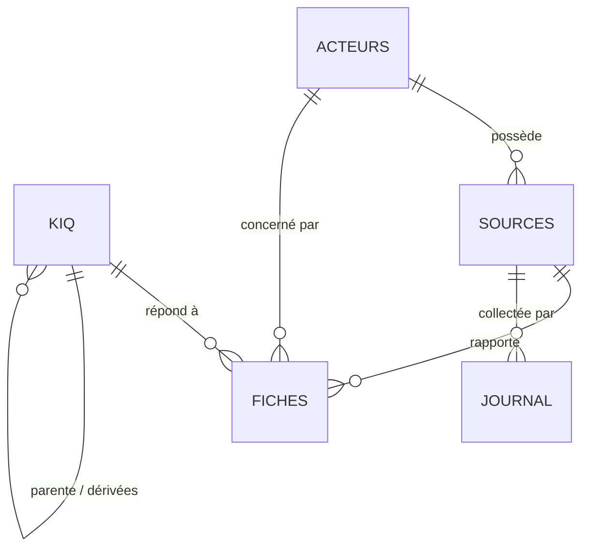

# Schéma de la base Airtable

Base d'équipe « Veille - MKG8102 ». Structure lue directement dans la base le 20 septembre 2026 (noms, types et descriptions de champs). Les identifiants internes (base, tables, champs, vues, enregistrements) ne sont pas publiés. Aucune donnée de la base n'est reproduite ici, sauf des effectifs agrégés.

## Vue d'ensemble

| Table | Rôle | Enregistrements au 20 sept. 2026 |
|---|---|---|
| KIQ | Une KIQ = une décision à éclairer | 3 (KIQ 1, 1.1, 1.2) |
| Acteurs | Acteurs suivis (RONA et concurrents directs) | 4 |
| Sources | Sources ouvertes collectées, avec biais connu et connecteur | 48 |
| Fiches de veille | Une fiche = un fait daté, sourcé, coté | 120 |
| Journal de collecte | Trace de chaque collecte, échecs compris | 154 |

## Champs

Le champ marqué **(H)** est réservé à l'humain ; **(M)** est écrit par la machine ; **(A)** est automatique (lien inverse, consultation ou numéro).

### KIQ

| Champ | Type | Précision |
|---|---|---|
| Énoncé | Texte long | Champ principal, question complète avec son horizon |
| Décision éclairée | Texte long | Décision et ce qui changerait selon la réponse |
| Décideur | Texte court | Un poste, jamais une personne |
| Échéance de réponse | Date | |
| Hypothèses rivales | Texte long | H1, H2, H3 |
| Indicateurs discriminants | Texte long | Une ligne par indicateur observable |
| Statut | Sélection | |
| KIQ parente | Lien vers KIQ | Vide pour une KIQ centrale |
| KIQ dérivées | Lien vers KIQ (A) | Inverse de « KIQ parente » |
| Fiches | Lien vers Fiches de veille (A) | Inverse de « KIQ » dans les fiches |

### Acteurs

| Champ | Type | Précision |
|---|---|---|
| Nom | Texte court | Champ principal |
| Type | Sélection | Concurrent direct, concurrent indirect, fournisseur, régulateur, client, autre |
| Site web | URL | |
| Notes | Texte long | Taille, positionnement, éléments stables |
| Fiches | Lien (A) | Inverse de « Acteur » dans les fiches |
| Sources | Lien (A) | Inverse de « Acteur » dans les sources |

### Sources

| Champ | Type | Précision |
|---|---|---|
| Nom | Texte court | Champ principal, par exemple « Site X, page carrières » |
| Adresse | URL | Adresse exacte à collecter |
| Type | Sélection | Primaire ou secondaire |
| Fiabilité | Sélection | Fiable, Moyen, Pauvre, À coter (voir [grille](05_grille_de_confiance.md)) |
| Connecteur | Sélection | Firecrawl, Apify, Manuel |
| Fréquence | Sélection | |
| Dernière collecte | Date | |
| Biais connu | Texte long | Ce que la source déforme systématiquement, et comment la collecter |
| Ville | Texte court | Ville ou région de la succursale couverte |
| Acteur | Lien vers Acteurs | |
| Fiches de veille | Lien (A) | |
| Journal de collecte | Lien (A) | |

### Fiches de veille

Ordre des champs conforme au format de sortie de la [Skill](../SKILL.md).

| Champ | Type | Écrit par | Précision |
|---|---|---|---|
| Titre | Texte court | M | Champ principal |
| Date du fait | Texte | M | Texte et non date : « non indiquée » est une valeur permise |
| Date de captation | Date | M | Date réelle de la collecte |
| Adresse exacte | URL | M | Adresse de la page effectivement collectée |
| Extrait cité | Texte long | M | Copié mot pour mot |
| Source | Lien vers Sources | M | |
| Acteur | Lien vers Acteurs | M | |
| KIQ | Lien vers KIQ | M | |
| Forme de veille | Sélection | M | Concurrentielle, commerciale, technologique, sociétale |
| Résumé | Texte long | M | Trois phrases, faits seulement |
| Nature | Sélection | M | Fait, interprétation, recommandation |
| Hypothèse concernée | Sélection | M | H1, H2, H3, aucune |
| Crédibilité | Sélection | M ou H | Échelle de l'équipe |
| Niveau de confiance | Sélection | M | Élevé, moyen, faible |
| Pertinence | Note de 1 à 5 | M | Au regard de la KIQ rattachée |
| **Statut** | Sélection | **H** | À valider à la création ; bascule vers validée ou rejetée par un humain |
| **Validé par** | Collaborateurs | **H** | Réservé à l'humain |
| **Motif de rejet** | Sélection | **H** | Liste fermée : date inventée, citation inexacte, hors KIQ, autre |
| Ville | Consultation (A) | A | Reprise du champ Ville de la source liée |
| Champs vides signalés | Texte long | M | Ce que le modèle n'a pas pu documenter : signalé, jamais deviné |
| Connecteur | Sélection | M | Connecteur d'origine, pour la traçabilité |

### Journal de collecte

| Champ | Type | Précision |
|---|---|---|
| Identifiant | Numéro automatique | Champ principal |
| Date et heure | Date et heure | Stockée en UTC |
| Connecteur | Sélection | Firecrawl, Apify, Manuel, Firecrawl + Apify |
| Éléments retenus | Nombre | Nombre de faits retenus ; zéro est une valeur permise |
| Erreurs | Texte long | Page bloquée, délai dépassé, contenu vide ; sert aussi à consigner la raison d'un repli manuel |
| Opératrice ou opérateur | Collaborateurs | |
| Source | Lien vers Sources | |

## Vues et interfaces

| Table | Vues constatées | Type |
|---|---|---|
| Fiches de veille | Fiches - Kanban par Statut ; Fiches - Validées | Kanban ; grille |
| Journal de collecte | Grid view ; Journal - Calendrier | Grille ; calendrier |
| KIQ, Acteurs, Sources | Non inspectées | **Non vérifié** |

Aucune interface Airtable (lecture du 18 sept. 2026). Le mode « tiré » du cours (vue Validée en lecture seule pour le décideur) repose donc sur une vue de grille, non sur une interface.

## Automatisations natives

Quatre automatisations, toutes des alertes ne modifiant aucune donnée : fiches à valider depuis plus de trois jours (quotidienne), sources en retard de collecte (hebdomadaire), fiche entrant dans une vue (deuxième point de contrôle), et un brouillon non déployé. Voir [alertes et seuils](04_alertes_et_seuils.md) et [défaillances](06_defaillances_connues.md).

## Écarts constatés dans la base

- Les descriptions des champs « Fiabilité » et « Crédibilité » indiquent que seule l'option provisoire « À coter » existe, alors que les options Fiable, Moyen, Pauvre et À coter sont en usage.
- Le champ « Fréquence » vaut « Hebdomadaire » pour les 48 sources, alors que le mandat prévoit un rythme mensuel pour le localisateur BMR.
- Le mandat indique 48 sources ; sa déclaration d'usage de l'IA en mentionne 49.
