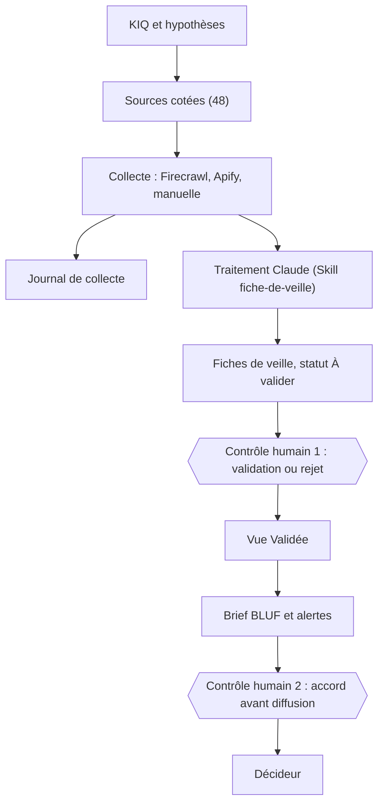
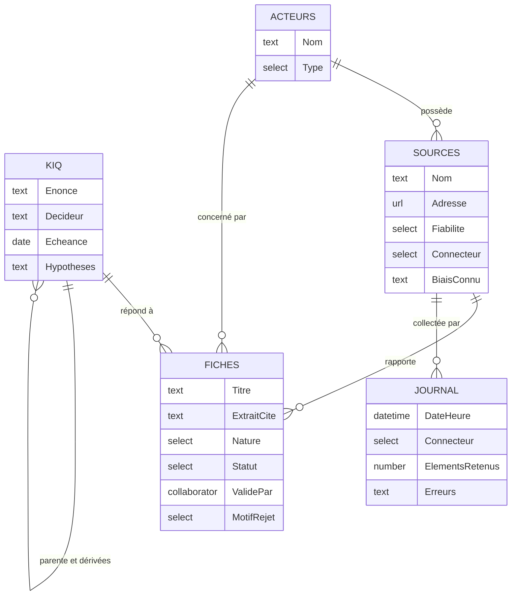
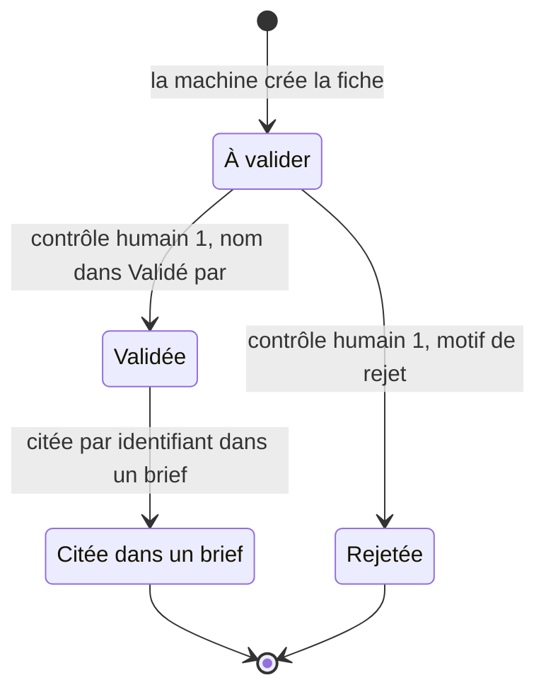
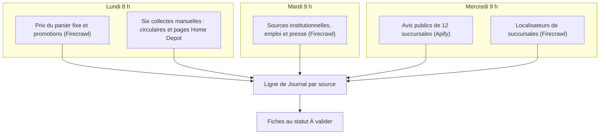
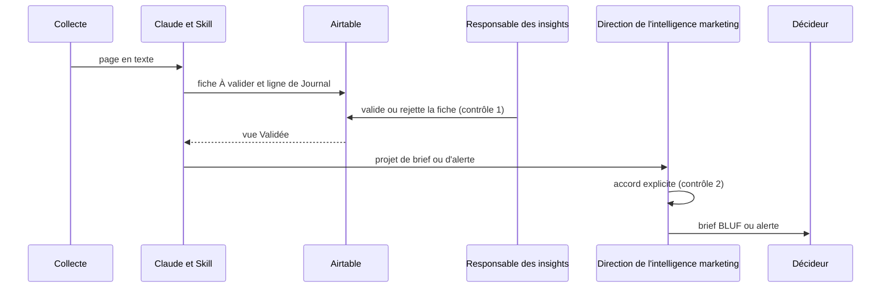
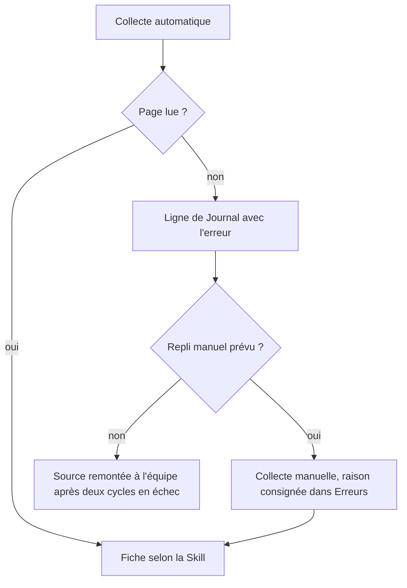

# Schémas du dispositif

Six schémas Mermaid, rendus directement par GitHub. Ils décrivent le dispositif **tel que documenté** dans ce dépôt ; les étapes non essayées sont signalées sous chaque schéma.

## 1. Architecture générale

## 2. Modèle de données

Cinq tables reliées. Le détail des champs est dans [02_schema_airtable.md](02_schema_airtable.md).

## 3. Cycle de vie d'une fiche

La machine s'arrête à « À valider » : la bascule est un acte humain.

Constat au 20 sept. 2026 : 120 fiches, dont 60 à valider, 53 validées et 7 rejetées.

## 4. Calendrier hebdomadaire de collecte

Rythme déclaré par le mandat ; trois tâches planifiées actives d'après la capture fournie par l'équipe.

Une septième collecte manuelle, le localisateur BMR, est prévue chaque mois par le mandat.

## 5. Diffusion et contrôles humains

**Non essayé à ce jour** : l'envoi du brief et des alertes par Gmail (dernière étape). Les trois automatisations Airtable d'alerte interne sont un mécanisme distinct, décrit dans [04_alertes_et_seuils.md](04_alertes_et_seuils.md).

## 6. Gestion des échecs de collecte

Exemples réels : panne d'authentification d'Apify le 9 sept. (12 échecs puis 12 reprises), circulaires inaccessibles aux robots, pages Home Depot dépendantes de la succursale. Voir [06_defaillances_connues.md](06_defaillances_connues.md).
